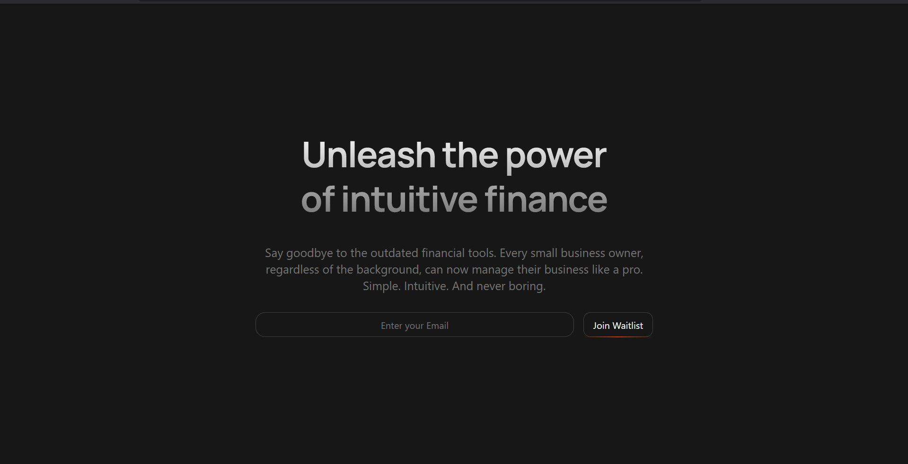

# HERO 1


# When to Use Which Size in Tailwind CSS - Decision Guide

## The Problem Students Face

"I know `w-full`, `w-1/2`, `w-64`, `max-w-4xl` exist... but **WHEN** do I use each one?"

This guide answers that question with clear rules and real examples.

---

## Quick Decision Tree

```
Do you want the element to...

├─ Fill its parent container?
│  └─ Use: w-full (or h-full)
│
├─ Be a specific pixel size that never changes?
│  └─ Use: w-64, w-96, h-48 (fixed sizes)
│
├─ Be a fraction of its parent?
│  └─ Use: w-1/2, w-1/3, w-2/3 (fractions)
│
├─ Have a maximum width but be flexible below that?
│  └─ Use: max-w-4xl, max-w-md (max-widths)
│
└─ Fill the entire browser window?
   └─ Use: w-screen, h-screen (viewport sizes)
```

---

## Rule 1: Use `w-full` (100%) When...

### Use When:

- Element should fill its parent container
- You want the element to be **responsive by default**
- Mobile-first designs (most mobile elements are full-width)
- Forms, inputs, buttons on mobile
- Images that should stretch to container width

### Examples:

```jsx
// GOOD: Mobile buttons should fill width
<button className="w-full md:w-auto px-6 py-3">
  Click Me
</button>
// Mobile: Full width
// Desktop: Auto width (just fits content + padding)

// GOOD: Form inputs fill their container
<input
  type="text"
  className="w-full border p-2 rounded"
  placeholder="Email"
/>

//  GOOD: Images fill their grid cell
<div className="grid grid-cols-3 gap-4">
  
  
  
</div>

// GOOD: Cards fill their column
<div className="grid grid-cols-1 md:grid-cols-3 gap-4">
  <div className="w-full border p-4 rounded">Card 1</div>
  <div className="w-full border p-4 rounded">Card 2</div>
  <div className="w-full border p-4 rounded">Card 3</div>
</div>
```

### Don't Use When:

- You want a fixed navbar that doesn't change size
- You need a specific icon size
- You want centered content with max-width

---

## Rule 2: Use Fixed Sizes (`w-64`, `w-96`) When...

### Use When:

- Specific pixel size is required
- Icons and avatars
- Sidebars with fixed width
- Elements that shouldn't change size
- Design mockups specify exact dimensions

### Tailwind Size Reference:

```
w-4  = 16px   (tiny icon)
w-6  = 24px   (small icon)
w-8  = 32px   (medium icon)
w-10 = 40px   (avatar)
w-12 = 48px   (large avatar)
w-16 = 64px
w-20 = 80px
w-24 = 96px
w-32 = 128px
w-40 = 160px
w-48 = 192px
w-64 = 256px  (sidebar)
w-96 = 384px  (wide sidebar)
```

### Examples:

```jsx
//  GOOD: Icons should be fixed size
<div className="flex items-center gap-2">
  <svg className="w-5 h-5 text-blue-500">...</svg>
  <span>Settings</span>
</div>

//  GOOD: Avatar with fixed size


//  GOOD: Sidebar with fixed width
<div className="flex">
  <aside className="w-64 bg-gray-100 h-screen p-4">
    Sidebar
  </aside>
  <main className="flex-1 p-4">
    Main Content
  </main>
</div>

//  GOOD: Logo with fixed size


//  GOOD: Square image thumbnail
<div className="w-20 h-20 bg-gray-200 rounded">
  Thumbnail
</div>
```

### Don't Use When:

- Element needs to be responsive
- Content inside might change size
- You want it to adapt to different screens

---

## Rule 3: Use Fractions (`w-1/2`, `w-1/3`) When...

### Use When:

- Splitting space between multiple elements
- Creating columns without grid
- You want **equal divisions**
- Parent has defined width

### Available Fractions:

```
w-1/2  = 50%
w-1/3  = 33.333%
w-2/3  = 66.666%
w-1/4  = 25%
w-3/4  = 75%
w-1/5  = 20%
w-2/5  = 40%
w-3/5  = 60%
```

### Examples:

```jsx
//  GOOD: Split screen layout (50-50)
<div className="flex">
  <div className="w-1/2 bg-blue-100 p-4">Left Half</div>
  <div className="w-1/2 bg-green-100 p-4">Right Half</div>
</div>

//   GOOD: Sidebar (1/3) and content (2/3)
<div className="flex">
  <aside className="w-1/3 bg-gray-100 p-4">Sidebar</aside>
  <main className="w-2/3 p-4">Main Content</main>
</div>

//  GOOD: Three equal columns
<div className="flex gap-4">
  <div className="w-1/3 border p-4">Column 1</div>
  <div className="w-1/3 border p-4">Column 2</div>
  <div className="w-1/3 border p-4">Column 3</div>
</div>

//  GOOD: Image gallery
<div className="flex flex-wrap">
  
  
  
  
</div>

//  GOOD: Form with label and input
<div className="flex gap-4 items-center">
  <label className="w-1/4">Name:</label>
  <input className="w-3/4 border p-2" type="text" />
</div>
```

### Don't Use When:

- Grid would be better (use `grid-cols-3` instead)
- Need gaps between items (use grid with gap)
- Content size varies greatly

### Pro Tip: Grid vs Fractions

```jsx
//    Don't do this with fractions + gap
<div className="flex gap-4">
  <div className="w-1/3">...</div>  {/* Gap messes up 1/3 calculation! */}
  <div className="w-1/3">...</div>
  <div className="w-1/3">...</div>
</div>

//  Use grid instead
<div className="grid grid-cols-3 gap-4">
  <div>...</div>
  <div>...</div>
  <div>...</div>
</div>
```

---

## Rule 4: Use `max-w-*` (max-width) When...

### Use When:

- Content should have a maximum width but shrink on smaller screens
- **MOST COMMON FOR PAGE LAYOUTS**
- Readable text content (don't want text lines too wide)
- Centered containers
- Responsive cards that shouldn't get too wide

### Max-Width Reference:

```
max-w-xs   = 320px  (mobile)
max-w-sm   = 384px  (small card)
max-w-md   = 448px  (medium card/modal)
max-w-lg   = 512px  (large card)
max-w-xl   = 576px  (form)
max-w-2xl  = 672px  (article)
max-w-3xl  = 768px  (wide article)
max-w-4xl  = 896px  (page content)
max-w-5xl  = 1024px (wide page)
max-w-6xl  = 1152px (full page)
max-w-7xl  = 1280px (very wide page)
```

### Examples:

```jsx
//  GOOD: Page container - most common pattern!
<div className="max-w-4xl mx-auto px-4 py-8">
  <h1>My Blog Post</h1>
  <p>Content here...</p>
</div>
// Grows up to 896px, then stops
// Centers with mx-auto
// Has padding on sides with px-4

//  GOOD: Readable text content
<article className="max-w-2xl mx-auto prose">
  <p>Long article text that shouldn't stretch too wide...</p>
</article>

//  GOOD: Modal that's responsive
<div className="max-w-md mx-auto bg-white rounded-lg p-6">
  <h2>Sign Up</h2>
  <form>...</form>
</div>

//  GOOD: Hero section
<section className="max-w-6xl mx-auto px-4">
  <h1 className="text-4xl">Welcome</h1>
  <p>Subtitle</p>
</section>

//  GOOD: Card that shouldn't get too wide
<div className="max-w-sm mx-auto border rounded-lg p-4">
  
  <h3>Product Name</h3>
  <button className="w-full">Buy Now</button>
</div>
```

### Don't Use When:

- Element should always be full width
- Inside a grid column (grid already controls width)
- You need exact pixel width

### The Classic Page Layout Pattern:

```jsx
// This is THE MOST COMMON pattern for web pages
<div className="mx-auto max-w-6xl px-4 py-8">{/* Your content here */}</div>

// Breaking it down:
// max-w-6xl  = Don't exceed 1152px width
// mx-auto    = Center it horizontally
// px-4       = Padding on left/right (prevents touching edges)
// py-8       = Padding on top/bottom
```

---

## Rule 5: Use `w-screen` / `h-screen` When...

### Use When:

- Full-screen overlays
- Modals/popups background
- Hero sections
- Landing pages
- Splash screens

### Examples:

```jsx
//  GOOD: Full-screen modal overlay
<div className="fixed inset-0 w-screen h-screen bg-black bg-opacity-50 flex items-center justify-center">
  <div className="max-w-md bg-white rounded-lg p-6">
    Modal Content
  </div>
</div>

//  GOOD: Full-height hero section
<section className="h-screen flex items-center justify-center bg-gradient-to-r from-blue-500 to-purple-500">
  <h1 className="text-6xl text-white">Welcome</h1>
</section>

// GOOD: Sidebar layout with full height
<div className="flex h-screen">
  <aside className="w-64 bg-gray-100">Sidebar</aside>
  <main className="flex-1 overflow-auto">Content</main>
</div>

// GOOD: Loading screen
<div className="w-screen h-screen flex items-center justify-center bg-white">
  <div className="animate-spin w-12 h-12 border-4 border-blue-500 border-t-transparent rounded-full"></div>
</div>
```

### Don't Use When:

- Regular content sections (use max-w instead)
- Inside containers (will overflow)
- Cards or components

---

## Real-World Decision Examples

### Example 1: Building a Card

```jsx
//    Question: What width for the card?

//    WRONG: w-screen (too wide!)
<div className="w-screen border rounded p-4">Card</div>

//    WRONG: w-64 (fixed, not responsive)
<div className="w-64 border rounded p-4">Card</div>

//   CORRECT: w-full inside a grid
<div className="grid grid-cols-1 md:grid-cols-3 gap-4">
  <div className="w-full border rounded p-4">Card</div>
</div>

//   ALSO CORRECT: max-w for standalone card
<div className="max-w-sm mx-auto border rounded p-4">Card</div>
```

**Decision Logic:**

- In a grid? Use `w-full` (fills grid cell)
- Standalone? Use `max-w-sm` (limits size, stays responsive)

---

### Example 2: Building a Button

```jsx
//    Question: What width for the button?

// Mobile: Full width
// Desktop: Auto width (fits content)

//   CORRECT:
<button className="w-full md:w-auto px-6 py-3 bg-blue-500 text-white rounded">
  Click Me
</button>

// Alternative for always auto:
<button className="px-6 py-3 bg-blue-500 text-white rounded">
  Click Me
</button>
// No width class = auto width = fits content + padding
```

**Decision Logic:**

- Mobile buttons: Usually `w-full` (easier to tap)
- Desktop buttons: Usually `w-auto` or no width class

---

### Example 3: Building a Form

```jsx
//    Question: What width for form and inputs?

//   CORRECT:
<div className="mx-auto max-w-md p-4">
  {/* Form container: max-w-md (good for forms) */}

  <input
    type="text"
    className="mb-4 w-full rounded border p-2"
    placeholder="Name"
  />
  {/* Input: w-full (fills form width) */}

  <input
    type="email"
    className="mb-4 w-full rounded border p-2"
    placeholder="Email"
  />

  <button className="w-full rounded bg-blue-500 py-2 text-white">Submit</button>
  {/* Button: w-full (full width looks good in forms) */}
</div>
```

**Decision Logic:**

- Form container: `max-w-md` (forms shouldn't be too wide)
- Inputs: `w-full` (fill the form container)
- Submit button: `w-full` (looks better in forms)

---

### Example 4: Building a Navbar

```jsx
//    Question: What width for navbar container?

//   CORRECT:
<nav className="border-b">
  <div className="mx-auto flex max-w-6xl items-center justify-between px-4 py-3">
    {/* Inner container: max-w-6xl (content shouldn't be too wide) */}

    
    {/* Logo: fixed height, auto width (maintains aspect ratio) */}

    <ul className="flex gap-6">
      <li>
        <a href="/">Home</a>
      </li>
      <li>
        <a href="/about">About</a>
      </li>
    </ul>
  </div>
</nav>
```

**Decision Logic:**

- Navbar background: No width class (full width)
- Navbar content: `max-w-6xl` (limits content width)
- Logo: `h-8 w-auto` (fixed height, auto width keeps ratio)

---

### Example 5: Building an Image Gallery

```jsx
//    Question: How to size the images?

//  CORRECT:
<div className="grid grid-cols-2 gap-4 md:grid-cols-3 lg:grid-cols-4">
  
  
  
  {/* w-full: fills grid cell */}
  {/* h-auto: maintains aspect ratio */}
</div>
```

**Decision Logic:**

- Grid controls columns (responsive layout)
- Images: `w-full h-auto` (fill cell, keep ratio)

---

## Common Student Questions

### Q1: "Why use `max-w-4xl` instead of `w-4xl`?"

**Answer:** `w-4xl` doesn't exist! Only `max-w-*` exists for these sizes.

```jsx
//    WRONG: w-4xl doesn't exist
<div className="w-4xl">

//   CORRECT:
<div className="max-w-4xl">
```

**Why?** Because these are meant to be **maximum widths** that shrink on smaller screens.

---

### Q2: "When do I use `w-full` vs no width class at all?"

**Answer:**

```jsx
// No width class = width: auto = fits content
<button className="px-6 py-3">Button</button>
// Width adjusts to fit text + padding

// w-full = width: 100% = fills parent
<button className="w-full px-6 py-3">Button</button>
// Width fills entire parent container
```

**Rule:**

- Want it to **fill parent**? Use `w-full`
- Want it to **fit content**? Don't use width class

---

### Q3: "Should I use Grid or Flex with fractions?"

**Answer:** Use **Grid** 99% of the time!

```jsx
//    OKAY but not ideal:
<div className="flex">
  <div className="w-1/3">A</div>
  <div className="w-1/3">B</div>
  <div className="w-1/3">C</div>
</div>

//   BETTER:
<div className="grid grid-cols-3">
  <div>A</div>
  <div>B</div>
  <div>C</div>
</div>
```

**Why Grid is Better:**

- Handles gaps automatically
- More responsive
- Easier to read
- Wraps nicely on mobile

**When to use Flex + Fractions:**

- When you have **2 items** with **different sizes**
- Sidebar layouts

```jsx
//   Good use of flex + fractions:
<div className="flex">
  <aside className="w-1/4">Sidebar</aside>
  <main className="w-3/4">Content</main>
</div>
```

---

### Q4: "My element has both `w-full` and `max-w-4xl`. Which wins?"

**Answer:** **BOTH apply!**

```jsx
<div className="mx-auto w-full max-w-4xl">Content</div>
```

**What happens:**

- `w-full`: "Be as wide as your parent"
- `max-w-4xl`: "But don't exceed 896px"
- `mx-auto`: "And center yourself"

**Result:**

- On mobile (375px wide): Element is 375px (w-full)
- On tablet (768px wide): Element is 768px (w-full)
- On desktop (1920px wide): Element is 896px (max-w-4xl kicks in)
- Always centered (mx-auto)

---

## The Ultimate Cheat Sheet

```jsx
/* INSIDE A GRID COLUMN */
<div className="grid grid-cols-3">
  <div className="w-full">  ← Always w-full
    ...
  </div>
</div>

/* PAGE CONTAINER */
<div className="max-w-6xl mx-auto px-4">  ← Always this pattern
  ...
</div>

/* FORM */
<div className="max-w-md mx-auto">  ← max-w-md for form container
  <input className="w-full" />      ← w-full for inputs
  <button className="w-full">      ← w-full for button
</div>

/* BUTTON */
<button className="w-full md:w-auto">  ← Full on mobile, auto on desktop
  Click
</button>

/* ICON */
<svg className="w-5 h-5">  ← Fixed size
  ...
</svg>

/* IMAGE IN CARD */
  ← Full width, auto height (keeps ratio)

/* SIDEBAR LAYOUT */
<div className="flex">
  <aside className="w-64">       ← Fixed width sidebar
  <main className="flex-1">      ← flex-1 takes remaining space
</div>

/* MODAL OVERLAY */
<div className="fixed inset-0 w-screen h-screen">  ← Full screen
  <div className="max-w-md mx-auto">               ← Centered modal
    ...
  </div>
</div>
```

---

## Practice Decision-Making

Try to decide what width to use **before** looking at the answer:

### Exercise 1:

"I want to create a blog post container that doesn't stretch too wide on big screens"

<details>
<summary>Click for answer</summary>

```jsx
<article className="mx-auto max-w-2xl px-4 py-8">
  <h1>Blog Title</h1>
  <p>Content...</p>
</article>
```

**Why?**

- `max-w-2xl`: Good for readable text width
- `mx-auto`: Centers it
- `px-4`: Side padding
</details>

---

### Exercise 2:

"I want 4 product cards in a row on desktop, but stacked on mobile"

<details>
<summary>Click for answer</summary>

```jsx
<div className="grid grid-cols-1 gap-4 md:grid-cols-2 lg:grid-cols-4">
  <div className="w-full rounded border p-4">Product 1</div>
  <div className="w-full rounded border p-4">Product 2</div>
  <div className="w-full rounded border p-4">Product 3</div>
  <div className="w-full rounded border p-4">Product 4</div>
</div>
```

**Why?**

- Use **Grid** (not flex + fractions)
- Cards use `w-full` to fill grid cells
- Grid handles responsive columns
</details>

---

### Exercise 3:

"I want a logo in my navbar that's always 40px tall"

<details>
<summary>Click for answer</summary>

```jsx

```

**Why?**

- `h-10`: Fixed height (40px)
- `w-auto`: Width adjusts to maintain aspect ratio
</details>

---

## Final Decision Framework

Before choosing a width class, ask yourself:

1. **Is it in a Grid?** → Use `w-full`
2. **Is it a page container?** → Use `max-w-*` + `mx-auto` + `px-4`
3. **Is it an icon/avatar?** → Use fixed size like `w-6 h-6`
4. **Is it a form input?** → Use `w-full`
5. **Is it a button?** → Use `w-full md:w-auto` (mobile-first)
6. **Is it a modal overlay?** → Use `w-screen h-screen`
7. **Is it an image in a card?** → Use `w-full h-auto`
8. **Does it need to fill parent?** → Use `w-full`
9. **None of the above?** → Try `max-w-*` first

---

**Remember:** When in doubt, start with `max-w-4xl mx-auto` for containers and `w-full` for content inside them. This covers 80% of use cases! 🎯
